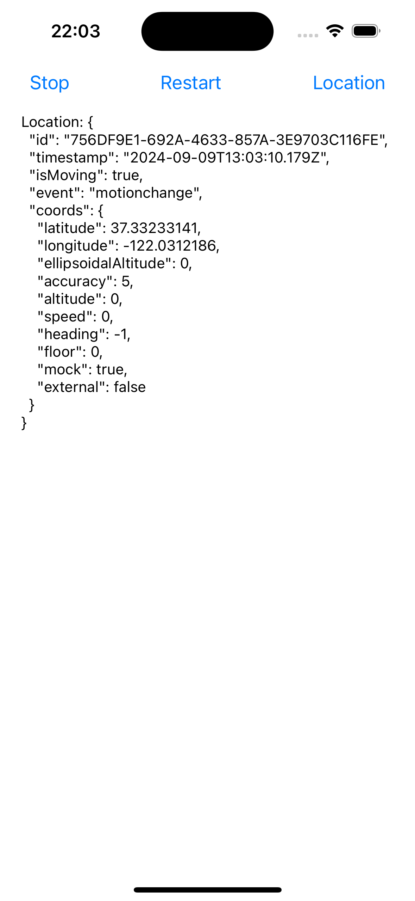

# rn-calmgeo

A React Native Module wrapper for [CalmGeo](https://github.com/t2tx/calm-geo)

## Compatibility

| iOS    | React Native |
| ------ | ------------ |
| >=17.0 | >=0.73.9     |

## Installation

> npm

```sh
npm install rn-calmgeo
```

> iOS

```sh
cd ios
pod install
```

## API

### 1. API List

> `RnCalmGeo`

| API                                                    | function                                                                     |
| ------------------------------------------------------ | ---------------------------------------------------------------------------- |
| start(config: [Config](#21-config)): Promise<boolean>  | start service                                                                |
| config(config: [Config](#21-config)): Promise<boolean> | config & restart service                                                     |
| stop(): Promise<void>                                  | stop service                                                                 |
| getCount(): Promise<number>                            | get local record count                                                       |
| getLocation(): Promise<Location>                       | get current location (also save to local storage)                            |
| clear(): Promise<void>                                 | clear local storage                                                          |
| sync(): Promise<void>                                  | upload to server                                                             |
| registerListener(listener: [Listener](#24-listener))   | regist location listener, return a unsubscriber function object `() => void` |

### 2. Types

#### 2.1 `Config`

| field                  | type                                   | description                                                                                                                                      |
| ---------------------- | -------------------------------------- | ------------------------------------------------------------------------------------------------------------------------------------------------ |
| desiredAccuracy        | [DesiredAccuracy](#25-desiredaccuracy) | Desired Accuracy                                                                                                                                 |
| distanceFilter         | number                                 | The minimum distance (measured in meters) a device must move horizontally before an update event is generated.                                   |
| disableSpeedMultiplier | boolean                                | Set true to disable automatic speed-based distanceFilter elasticity.                                                                             |
| speedMultiplier        | number                                 | Controls the scale of automatic speed-based distanceFilter elasticity.                                                                           |
| stationaryRadius       | number                                 | When stopped, the minimum distance the device must move beyond the stationary location for aggressive background-tracking to engage.             |
| url?                   | string                                 | Your server url where you wish to HTTP POST locations to                                                                                         |
| token?                 | string                                 | Bearer token                                                                                                                                     |
| httpTimeout            | number                                 | HTTP request timeout in milliseconds.                                                                                                            |
| method                 | [METHOD](#25-method)                   | The HTTP method.                                                                                                                                 |
| autoSync               | boolean                                | If you've enabled HTTP feature by configuring an url, the plugin will attempt to upload each location to your server as it is recorded.          |
| syncThreshold          | number                                 | The minimum number of persisted records to trigger an sync action.                                                                               |
| maxBatchSize           | number                                 | If you've enabled HTTP feature by configuring an url and autySync: true, this parameter will limit the number of records attached to each batch. |
| maxDaysToPersist       | number                                 | Maximum number of days to store a geolocation in local storage.                                                                                  |

#### 2.2 `Location`

| field     | type                 | description                                                 |
| --------- | -------------------- | ----------------------------------------------------------- |
| id        | string               | UUID                                                        |
| timestamp | string               | ISO-8601 UTC timestamp provided by the native location API. |
| isMoving  | boolean              | true if location was recorded while in the moving state.    |
| coords    | [COORDS](#23-coords) | location info                                               |

#### 2.3 `Coords`

| field               | type    | description                                                                    |
| ------------------- | ------- | ------------------------------------------------------------------------------ |
| latitude            | number  | latitude                                                                       |
| longitude           | number  | longitude                                                                      |
| accuracy            | number  | accuracy (m)                                                                   |
| altitude            | number  | altitude                                                                       |
| altitudeAccuracy    | number  | Accuracy of altitude (m)                                                       |
| ellipsoidalAltitude | number  | ellipsoidalAltitude                                                            |
| speed               | number  | speed (m/s)                                                                    |
| speedAccuracy       | number  | Accuracy of speed (m/s)                                                        |
| heading             | number  | heading (north: 0.0) (deg)                                                     |
| headingAccuracy     | number  | Accuracy of heading (deg)                                                      |
| floor               | number  | floor                                                                          |
| mock                | boolean | true if the system generates the location using on-device software simulation. |
| external            | boolean | true if the system receives the location from an external accessory.           |

#### 2.4 `Listener`

```js
function (location: Location) void
```

#### 2.5 `DesiredAccuracy`

- `BEST_FOR_NAVIGATION`
- `BEST`
- `TEN_METERS`
- `HUNDRED_METERS`
- `KILOMETER`
- `THREE_KILOMETERS`

#### 2.5 `Method`

- POST
- PUT

## Sample

```js
import {
  Config,
  desiredAccuracyEnum,
  requestMethodEnum,
  RnCalmGeo,
  type Location,
} from 'rn-calmgeo';

// config
const configJson: Config = {
  desiredAccuracy: desiredAccuracyEnum.enum.BEST_FOR_NAVIGATION,
  distanceFilter: 16,
  disableSpeedMultiplier: false,
  speedMultiplier: 3.1,
  stationaryRadius: 25.0,

  httpTimeout: 10000,
  method: requestMethodEnum.enum.POST,

  autoSync: true,
  syncThreshold: 12,
  maxBatchSize: 250,
  maxDaysToPersist: 7,
};

// App
export default function App() {
  const [loca, setLoca] = useState<Location | undefined>();

  useEffect(() => {
    RnCalmGeo.start(configJson).then((value: boolean) => {
      console.log('start', value);
    });

    const clean = RnCalmGeo.registerListener(location => {
        setLoca(location);
          console.log('getCount', value);
          setCount(value);
        });
    });

    return clean;
  }, []);

  return (
    <SafeAreaView style={styles.container}>
      <View style={styles.row}>
        <Button title="Stop" onPress={() => RnCalmGeo.stop()} />
        <Button title="Restart" onPress={() => RnCalmGeo.config(configJson)} />
        <Button title="Location" onPress={() => RnCalmGeo.getLocation()} />
      </View>

      <Text>Location: {JSON.stringify(loca, null, 2)}</Text>
    </SafeAreaView>
  );
}

const styles = StyleSheet.create({
  container: {
    marginHorizontal: 20,
    flex: 1,
    alignItems: 'flex-start',
    justifyContent: 'flex-start',
    gap: 10,
  },
  row: {
    alignSelf: 'stretch',
    gap: 10,
    maxHeight: 40,
    flexDirection: 'row',
    alignItems: 'center',
    justifyContent: 'space-between',
  },
  button: {
    backgroundColor: 'blue',
  },
});
```

## Sample Image

 

## Contributing

See the [contributing guide](CONTRIBUTING.md) to learn how to contribute to the repository and the development workflow.

## License

MIT

---

Made with [create-react-native-library](https://github.com/callstack/react-native-builder-bob)
